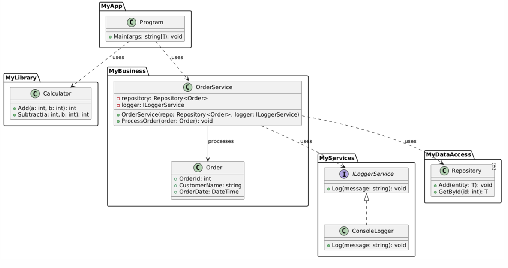

# Zadanie "Referencje"
---

## Zadanie: Zaawansowane rozwiązanie wieloprojektowe z referencjami, NuGet

### Cel zadania:
- Poznanie sposobu tworzenia rozwiązań wieloprojektowych.
- Nauka dodawania referencji między projektami (np. aplikacja konsolowa, biblioteka klas, moduł usług).
- Rozwinięcie umiejętności pracy z bibliotekami NuGet
- Zapoznanie się z zarządzaniem wersjami oraz aktualizacją zależności.

---




### Część 1: Struktura rozwiązania i referencje między projektami

1. **Utworzenie rozwiązania:**
   - Stwórz nowe rozwiązanie (Solution) o nazwie `MultiProjectNuGetDemo`.

2. **Projekt biblioteki klas – `MyLibrary`:**
   - Dodaj projekt typu **Class Library (.NET)** o nazwie `MyLibrary`.
   - Utwórz klasę `Calculator` z metodami:
     - `Add(int a, int b)` – zwracającą sumę dwóch liczb.
     - `Subtract(int a, int b)` – zwracającą różnicę.

3. **Projekt aplikacji konsolowej – `MyApp`:**
   - Dodaj projekt **Console Application** o nazwie `MyApp`.
   - W projekcie `MyApp` dodaj referencję do projektu `MyLibrary`
   - W metodzie `Main` dodaj dyrektywę `using MyLibrary;` i wywołaj metody klasy `Calculator`, wypisując wyniki na konsolę.

---

### Część 2: Wykorzystanie bibliotek NuGet

1. **Instalacja zewnętrznego pakietu:**
   - W projekcie `MyApp` otwórz Menedżera Pakietów NuGet.
   - Wyszukaj i zainstaluj **Newtonsoft.Json**.
   - W metodzie `Main` wykonaj operację, np.:
     ```csharp
     int sum = Calculator.Add(5, 3);
     var result = new { Operation = "Add", A = 5, B = 3, Result = sum };
     string jsonResult = JsonConvert.SerializeObject(result, Formatting.Indented);
     Console.WriteLine(jsonResult);
     ```
   - Dzięki temu zobaczysz, jak łatwo można korzystać z zewnętrznych bibliotek do obsługi popularnych zadań, jak serializacja JSON.

---

### Część 3: 
1. **Projekt usług – `MyServices`:**
   - Dodaj nowy projekt **Class Library (.NET)** o nazwie `MyServices`.
   - Utwórz interfejs `ILoggerService`:
     ```csharp
     public interface ILoggerService
     {
         void Log(string message);
     }
     ```
   - Utwórz implementację interfejsu, np. klasę `ConsoleLogger`:
     ```csharp
     public class ConsoleLogger : ILoggerService
     {
         public void Log(string message)
         {
             Console.WriteLine($"[LOG]: {message}");
         }
     }
     ```

2. **Konfiguracja Dependency Injection w `MyApp`:**
   - W projekcie `MyApp` dodaj referencję do projektu `MyServices`.
   - Zainstaluj NuGet-owy pakiet **Microsoft.Extensions.DependencyInjection**.
   - W metodzie `Main` skonfiguruj kontener DI:
     ```csharp
     using Microsoft.Extensions.DependencyInjection;
     using MyServices;

     // Konfiguracja kontenera DI
     var serviceProvider = new ServiceCollection()
         .AddSingleton<ILoggerService, ConsoleLogger>()
         .BuildServiceProvider();

     // Uzyskanie instancji loggera
     var logger = serviceProvider.GetService<ILoggerService>();
     logger.Log("Aplikacja uruchomiona.");

     // Przykładowe użycie kalkulatora
     int sum = Calculator.Add(10, 15);
     logger.Log($"Wynik dodawania: {sum}");
     ```

---

### Część 4: Zarządzanie wersjami i integracja

1. **Aktualizacja pakietów:**
   - Przeprowadź symulację aktualizacji pakietu, np. zmieniając wersję `Newtonsoft.Json` lub własnego pakietu `MyLibrary`.
   - SemVer?.
---

